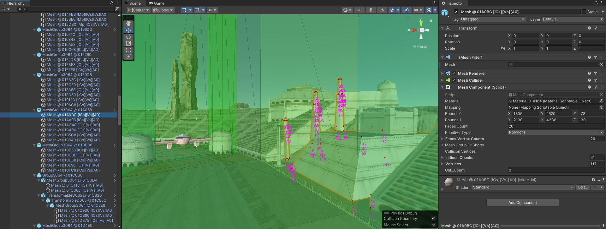

# swe1r-assets

C#/.NET/Unity tools and libraries for the game Star Wars Episode 1 Racer.

This project offers a suite of tools and libraries designed for modding and researching the game's file formats. It features advanced functionalities such as bit-perfect reserialization of game assets, a level editor based on Unity, OBJ model import and lays the groundwork for extensive analysis of the file formats and internal mechanics. Dive in to explore, contribute, and bring new life to a beloved classic!

https://github.com/akopetsch/swe1r-assets/assets/8048046/acab1213-d35a-4db6-8ffc-21e2000e55be

Imported OBJ model is by [Leadphalanx](https://forums.tigsource.com/index.php?topic=68973.0)

## Features

These are the key projects:

* [ByteSerialization](ByteSerialization/)
* [SWE1R.Assets.Blocks](SWE1R.Assets.Blocks/)
* [SWE1R.Assets.Blocks.CommandLine](SWE1R.Assets.Blocks.CommandLine/)
* [SWE1R.Assets.Blocks.Unity](SWE1R.Assets.Unity/)

## Issues

This project is still heavily WIP. This is an early preview release, 
and I welcome your feedback or contributions (forks, pull-requests, issues) to improve it, 
but you have to expect that the code base will change frequently due to refactorings and new features until things calm down a bit. 
Development is discussed in a Discord modding channel related to the game. 

The following are some major domains to work on:

* Refactoring
* Documentation
* More Unit-Tests (other than re-serialization)
* Packaging (NuGet/Unity)
* Integrate existing findings of the community (where big credit goes):
  * [louriccia/SWE1R-Mods](https://github.com/louriccia/SWE1R-Mods)
  * [OpenSWE1R/swe1r-tools](https://github.com/OpenSWE1R/swe1r-tools)
  * [Olganix/Sw_Racer](https://github.com/Olganix/Sw_Racer)
* ...

Feel free to tell me what features you need the most or tell me about any bugs you find.
